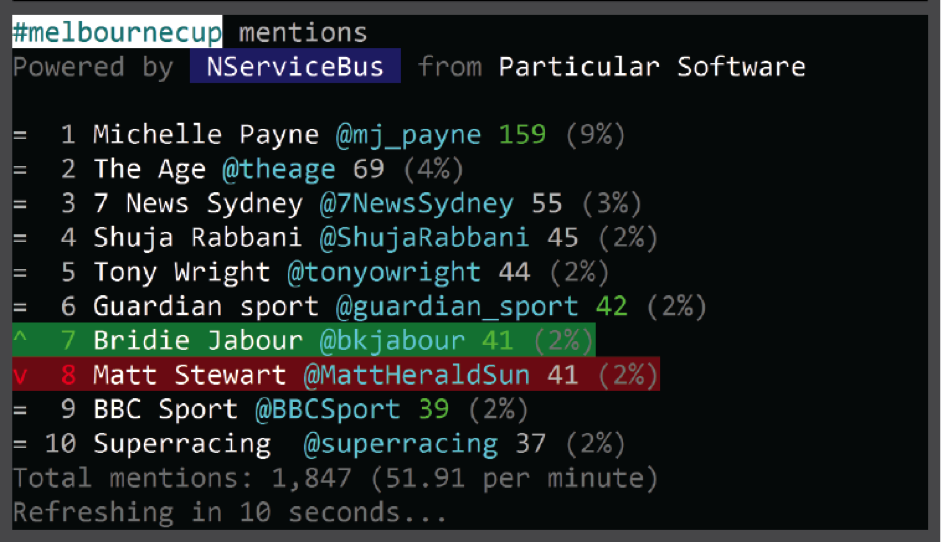

Overall description
===================

The Twitter leaderboard application, HashBus, is composed of two groups
of components. One group of components forms the server and the other
the client.

The server components monitor the public Twitter feed for a specific
search term, typically a hashtag, and create various statistics for
consumption by the client.

The client components provide a visualization of the statistics
collected by the server components.

The leaderboard application is designed to monitor one search term at a
time. This search term can be one or more hashtags, username or
arbitrary words.In order to monitor multiple search terms the server and
client components can be deployed multiple times in different
configurations. For conferences, we usually recommend deploying a single
instance of the components using the official conference hashtag as the
search term.

The leaderboard client components provide multiple dashboards showing
different leaderboards for tweets which match the search term, for
example:

-   Top Tweeters/Re-tweeters - who is tweeting and retweeting the most

-   Most Hashtagged - which hashtags are being used the most

-   Most Mentioned - who is being mentioned the most

-   Most Re-tweeted - who is being re-tweeted the most

and more...

The leaderboards can be configured to refresh periodically (the default
is ten seconds) and they highlight what has changed and how after each
refresh, including indicators showing the change that occurred on the
board (either a percentage or a green/red highlight with an arrow to
illustrate the movement).

Technical overview
==================

Source code and some technical details are in the readme.md at
[*https://github.com/Particular/HashBus*](https://github.com/Particular/HashBus)

Server components
-----------------

-   Multiple endpoints hosted on an Azure Windows VM

    -   hosted on a Particular Software azure account

-   Each server deployment can be configured to monitor one search term

-   Each component is a console application that could be run as Windows Service

    -   however we prefer to run them as console applications so that we can show attendees the internals of the server components

Client visualization components
-------------------------------

Client components can be deployed in 2 flavours:

-   A Javascript Single Page, browser hosted, application;

-   A set of console applications

Multiple clients can be run simultaneously connected to the same server
endpoint.

### Hardware requirements

-   A presentation screen with HDMI input

-   A computer or a computer stick to run the leaderboard console clients

    -   Successfully tested using Intel Compute Stick ([*http://www.intel.com/content/www/us/en/compute-stick/intel-compute-stick.html*](http://www.intel.com/content/www/us/en/compute-stick/intel-compute-stick.html))

### Software requirements

-   Windows Vista or later to run the console clients, otherwise any operating system to run a web browser

-   .NET Framework minimum required version 4.5.1 to run the console clients

Managing the board during an event
==================================

-   Deploy the backend components on an Azure VM

-   Connect and run the clients on screens

-   Test everything

-   We can show the Server endpoints (backend) running as well if we have a booth

-   Encourage speakers to mention the leader board in their talks. This can be done in a gamified way. For example, at BuildStuff 2015, the last speaker of the conference challenged his audience to get an old and esoteric language to the top of the Most Hashtagged leaderboard and this resulted in a huge spike of interest.

### References:

-   Images from BuildStuff 2016: <https://drive.google.com/open?id=0BwpEOzxAsahMVUE1b29IeVh2Zjg>

-   \[TBC\] Images from NSBCon 2016

-   Source issue with summary of the leaderboard built for Build Stuff 2015: [*https://github.com/Particular/Events/issues/73*](https://github.com/Particular/Events/issues/73)

